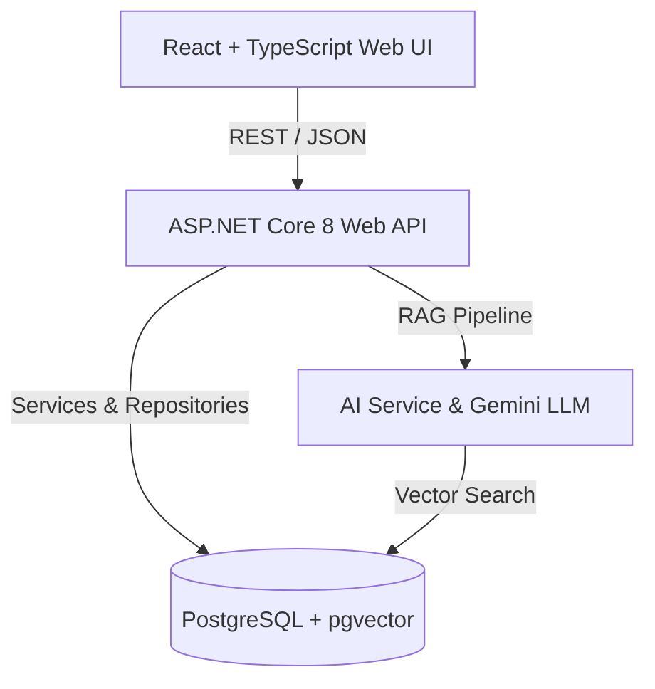

# Software Architecture Document
## SCIP - Smart Cybersecurity Intelligence Platform

### Architectural Principles
- **Clean Architecture & SOLID**: Loose coupling between Controllers, Services, and Repositories.
- **Monorepo Design**: Workspace management via `apps/` and `packages/`.
- **RAG Architecture**: PostgreSQL `pgvector` HNSW cosine index + Google Gemini LLM embedding pipeline.
